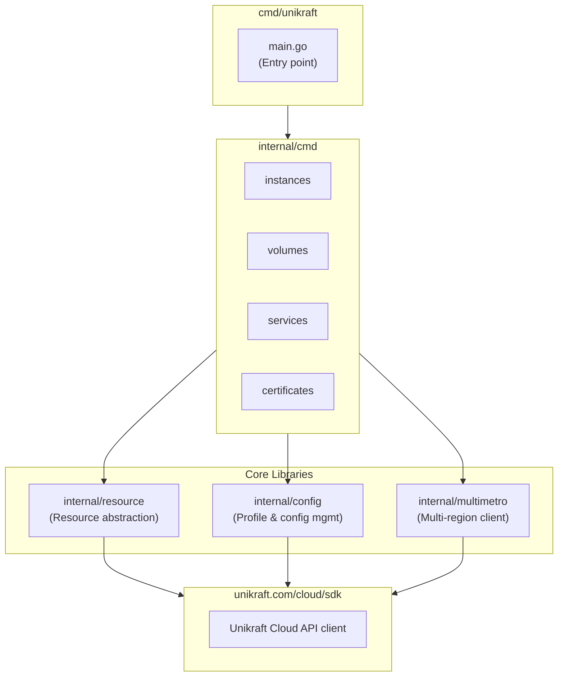

# Development Guide

This document provides an in-depth guide to developing the Unikraft CLI, including architecture details, coding patterns, and contribution workflows.


## Table of Contents

- [Prerequisites](#prerequisites)
- [Building](#building)
- [Testing](#testing)
- [Documentation](#documentation)
- [Architecture Overview](#architecture-overview)
- [Key Concepts](#key-concepts)
- [Directory Structure](#directory-structure)
- [Adding New Commands](#adding-new-commands)
- [Working with Resources](#working-with-resources)
- [Dependencies](#dependencies)
- [Debugging](#debugging)


## Prerequisites

- **Go 1.25+** — The CLI uses modern Go features
- **[Task](https://taskfile.dev)** — Task runner (optional but recommended)

Enable remote Taskfiles for shared build logic:

```bash
export TASK_X_REMOTE_TASKFILES=1
```


## Building

```bash
# Using Make (recommended, wraps Task)
make cli

# Or directly with Task
task cli

# Build with debug symbols
make DEBUG=y
```

The binary is placed in `./dist/unikraft`.


### Build Variables

The build system injects version information via ldflags:

- `Version` — Git tag or "dev"
- `Commit` — Git commit SHA
- `BuildTime` — Build timestamp


## Testing

```bash
# Run unit tests
make test

# Run linter (golangci-lint)
make lint

# Run integration tests (end-to-end scenarios)
make integration

# Update integration test expected outputs
make integration-update
```

Always run `make lint` and `make test` before submitting changes.
CI enforces these checks.


### Writing Tests

- Unit tests live alongside the code they test (`*_test.go`)
- Integration tests are in `cmd/unikraft/` with the `integration` build tag
- Use `gotest.tools/v3` assertions for clearer test failures
- Integration tests use golden files in `cmd/unikraft/testdata/`


## Documentation

```bash
# Generate all docs (man pages + markdown)
make docs

# Generate man pages only (compressed, in docs/man/)
make docs:man

# Generate markdown docs only (for website, in docs/mdx/)
make docs:mdx
```

Documentation is auto-generated from command definitions using tools in [`tools/gencli/`](./tools/gencli).


## Architecture Overview

The Unikraft CLI follows a layered architecture designed for maintainability and extensibility:



### Core Design Principles

1. **Single Binary** — Everything compiles into one `unikraft` executable
2. **Resource-Oriented** — API objects are modeled as Resources with consistent CRUD operations
3. **Multi-Metro** — Commands operate across multiple regions simultaneously
4. **Declarative Output** — Field definitions drive both display and editing


## Key Concepts

### The Resource Interface

The `Resource` interface is the core abstraction for all API objects:

```go
type Resource interface {
    Type() Type           // Resource type metadata (name, plural)
    Key() Key             // Unique identifier (name, UUID, etc.)
    Fields() ([]Field, error)  // Structured field representation
    Raw() any             // Original API response
}
```

Resources are extended with behavior interfaces:

| Interface           | Methods                     | Purpose                         |
| ------------------- | --------------------------- | ------------------------------- |
| `GettableResource`  | `Get(ctx, keys)`            | Fetch specific resources by key |
| `ListableResource`  | `List(ctx)`                 | List all resources              |
| `CreatableResource` | `Create(ctx, fields)`       | Create new resources            |
| `EditableResource`  | `Edit(ctx, target, fields)` | Modify existing resources       |
| `DeletableResource` | `Delete(ctx, targets)`      | Remove resources                |


### The Field System

Resources expose their data through a tree of `Field` nodes:

```go
type Field struct {
    Name      string         // Field name (used for output and selection)
    Value     any            // The field's value
    Subfields []Field        // Nested fields (for structs)
    Elem      *Field         // Template for array elements
    Verbosity FieldVerbosity // Display level (short, long, hidden, invisible)
    Create    *Patch         // Metadata for create operations
    Edit      *Patch         // Metadata for edit operations
}
```

Field verbosity controls output:
- `FieldVerbosityShort` — Shown in default/table output
- `FieldVerbosityLong` — Shown with `-o kv` or detailed views
- `FieldVerbosityHidden` — Available but not shown by default
- `FieldVerbosityInvisible` — Internal fields, never shown


### Struct Tags

Resource structs use custom tags to define behavior:

```go
type Instance struct {
    Name   string `mirror:"instance.name" field:",short" create:"set"`
    UUID   string `mirror:"instance.uuid" field:",long"`
    State  string `mirror:"instance.state" field:",short" edit:"set"`
    Memory int    `mirror:"instance.memory_mb" field:",short" create:"set" edit:"set"`
}
```

| Tag                      | Purpose                                       |
| ------------------------ | --------------------------------------------- |
| `mirror:"path"`          | Maps to API response field path               |
| `field:"name,verbosity"` | Output field name and visibility              |
| `create:"operations"`    | Allowed create operations (`set`, `required`) |
| `edit:"operations"`      | Allowed edit operations (`set`, `add`, `del`) |


### Multi-Metro Client

The `multimetro` package enables parallel operations across regions:

```go
// Creates clients for all configured metros
group, err := multimetro.NewClient(ctx)

// Execute operation across all metros in parallel
results := group.Each(ctx, func(ctx context.Context, client MetroClient) ([]Instance, error) {
    return client.Instances.List(ctx)
})
```


### Configuration & Profiles

Configuration is stored in `~/.config/unikraft/config.yaml`:

```yaml
telemetry: true
profile: default 
profiles:
  default:
    token: "..."
    metros:
    - name: fra
      endpoint: https://api.fra.unikraft.cloud
    - name: sfo
      endpoint: https://api.sfo.unikraft.cloud
```

The `config.Config` struct flows through context:

```go
cfg := config.G(ctx)                  // Get config from context
profile, err := cfg.CurrentProfile()  // Get active profile
```


## Directory Structure

```
.
├── cmd/unikraft/           # Entry point and integration tests
│   ├── main.go             # CLI entry point
│   ├── *_test.go           # Integration tests
│   └── testdata/           # Golden files for tests
│
├── internal/
│   ├── cmd/                # Command implementations
│   │   ├── root.go         # Root command and CLI struct
│   │   ├── instances.go    # Instance commands
│   │   ├── volumes.go      # Volume commands
│   │   └── ...
│   │
│   ├── config/             # Configuration management
│   │   ├── config.go       # Config struct and loading
│   │   ├── profile.go      # Profile management
│   │   └── context.go      # Context utilities
│   │
│   ├── resource/           # Resource abstraction layer
│   │   ├── resource.go     # Core interfaces
│   │   ├── struct.go       # Struct↔Field conversion
│   │   ├── cmd/            # Generic CRUD commands
│   │   ├── patch/          # Patch/diff utilities
│   │   └── value/          # Value formatting
│   │
│   ├── multimetro/         # Multi-region client handling
│   ├── logs/               # Log streaming utilities
│   ├── tui/                # Terminal UI components
│   ├── tablewriter/        # Table output formatting
│   └── x/                  # Internal utilities
│
├── docs/
│   ├── man/                # Generated man pages
│   └── markdown/           # Generated markdown docs
│
└── tools/
    ├── gencli/             # CLI documentation generator
    └── gendocs/            # Additional doc tooling
```


## Adding New Commands

### 1. Define the Resource Type

Create a struct representing the API object in `internal/cmd/`:

```go
// internal/cmd/widgets.go

type Widget struct {
    MetroName string `mirror:"metro.name" field:"metro,short" create:"set,required"`
    Name      string `mirror:"widget.name" field:",short" create:"set"`
    UUID      string `mirror:"widget.uuid" field:",long"`
    Size      int    `mirror:"widget.size" field:",short" create:"set" edit:"set"`

    // Store the raw API response
    Widget platform.Widget `field:"-"`
    Metro  *config.Metro   `field:"-"`
}
```


### 2. Implement the Resource Interface

```go
func (w Widget) Type() resource.Type {
    return resource.Type{Name: "widget", Names: "widgets"}
}

func (w Widget) Key() resource.Key {
    return WidgetKey{Metro: w.MetroName, Name: w.Name}
}

func (w Widget) Fields() ([]resource.Field, error) {
    return resource.FieldsFromStruct(w)
}

func (w Widget) Raw() any {
    return w.Widget
}
```


### 3. Implement Behavior Interfaces

```go
func (w Widget) List(ctx context.Context) ([]resource.Resource, error) {
    group, err := multimetro.NewClient(ctx)
    if err != nil {
        return nil, err
    }
    
    results := group.Each(ctx, func(ctx context.Context, c multimetro.MetroClient) ([]Widget, error) {
        widgets, err := c.Widgets.List(ctx)
        if err != nil {
            return nil, err
        }
        // Convert API response to Widget structs
        return convertWidgets(widgets, c.Metro), nil
    })
    
    return flatten(results), nil
}
```


### 4. Register the Command

Add to `internal/cmd/root.go`:

```go
type UnikraftCLI struct {
    // ... existing commands ...
    Widgets WidgetsCmd `cmd:"" help:"Manage Unikraft Cloud widgets." aliases:"widget,widgets"`
}
```

### 5. Create the Command Struct

Use embedded generic commands for standard operations:

```go
type WidgetsCmd struct {
    cmd.ResourceCmd[Widget]
    cmd.GettableResourceCmd[Widget]  `set:"name=widget" set:"names=widgets"`
    cmd.ListableResourceCmd[Widget]  `set:"name=widget" set:"names=widgets"`
    cmd.CreatableResourceCmd[Widget] `set:"name=widget" set:"names=widgets"`
    cmd.EditableResourceCmd[Widget]  `set:"name=widget" set:"names=widgets"`
    cmd.DeletableResourceCmd[Widget] `set:"name=widget" set:"names=widgets"`
}
```


## Working with Resources

### Field Selection

Users can select specific fields with `-f`:

```bash
unikraft instances list -f name,state,resources.memory
```

### Output Formats

The CLI supports multiple output formats via `-o`:

| Format     | Description                         |
| ---------- | ----------------------------------- |
| `table`    | Default tabular output              |
| `kv`       | Key-value pairs (shows more fields) |
| `json`     | JSON output                         |
| `yaml`     | YAML output                         |
| `quiet`    | Just keys/names                     |
| `raw`      | Raw API response                    |
| `template` | Go template                         |


### Filtering

List commands support containerd-style filters:

```bash
unikraft instances list --filter state==running
unikraft instances list --filter 'name~=web-*'
```


## Debugging

### Verbose Logging

```bash
# Debug level logging
unikraft --log-level=debug instances list

# Trace level (very verbose)
unikraft --log-level=trace instances list

# JSON log output (for parsing)
unikraft --log-type=json instances list
```


### Environment Variables

| Variable             | Purpose                                         |
| -------------------- | ----------------------------------------------- |
| `UNIKRAFT_LOG_LEVEL` | Set log level (trace, debug, info, warn, error) |
| `UNIKRAFT_LOG_TYPE`  | Set log format (text, json)                     |


### Using Delve

```bash
# Build with debug symbols
make DEBUG=y

# Debug with Delve
dlv exec ./dist/unikraft -- instances list
```


### API Debugging

To see raw API responses:

```bash
unikraft instances list -o raw
unikraft instances get my-instance -o json
```


## Tips for Contributors

1. **Run quality gates locally** — Always run `make lint` and `make test` before pushing
2. **Use atomic commits** — Each commit should be a logical, self-contained change
3. **Follow existing patterns** — Look at similar commands for guidance
4. **Add tests** — New functionality should include tests
5. **Update docs** — Run `make docs` if you change command structure
6. **Use modern Go** — Feel free to use the latest Go features

For contribution guidelines and commit message format, see [CONTRIBUTING.md](CONTRIBUTING.md).
